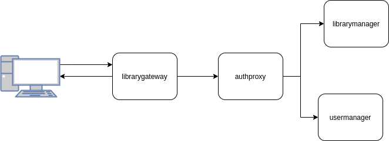

# bibliotheque
Projet de gestion d'une bibliothèque crée par Julien Monteil et Florian RICHARD.

Le sujet de TP ce trouve à la racine du projet tout comme la preuve d'éxecution.

## Prérequis
Pour pouvoir utiliser notre application vous devez disposer des logiciels suivants:

 - Docker
 - Make
 - Un navigateur web
 - Un client Git
 
 Pour récupérer le projet il faut cloner le dépôt Git sur votre machine.
 Cliquez [ici](https://github.com/FloRichard/bibliotheque) pour accèder au dépôt. Il est en accès libre.
 
 Aucun SGBD est nécessaire, tout est conteneurisé dans des conteneurs Docker.

 
## Deployer les services
Il y'a trois moyens pour déployer nos services.

Si vous avez `Make` d'installé sur votre machine:

- Deployer l'ensemble des services(recommandé): 
  - Aller à la racine du projet `/bibliotheque`
  - Ouvrez un terminal et selon votre système d'exploitation tapez :
    - `make deploy_linux`
    - `make deploy_windows`

- Deployer les services un à un (non-recommandé):
    - Ouvrez un terminal et allez dans le dossier de chaque service et rentrez la commande `make deploy`

Si vous n'avez pas `Make` d'installer sur votre machine:

- Aller à la racine de chaque service et rentrez la commande `docker-compose up -d`

Chaque services va écouter un port spécifique de votre machine, il faut donc veillez au préable que les ports suivants sont disponibles.
- librarygateway: **8080**
- authproxy:      **8081**
- usermanager:    **8082**
- librarymanager: **8083**


Pour accèder à la page d'accueil de l'application copié-collé l'url suivante dans votre navigateur : http://localhost:8080/library/

L'application dipose d'un compte administrateur par défaut. Veuillez utiliser celui-ci la première fois que vous vous connectez.
- nom d'utilisateur : admin
- mot de passe : admin

Pour supprimer les services allez à la racine du projet et entrez la commande `make down_linux` ou `make down_windows` selon votre système d'éxploitation.

 ## Architecture
 Notre application est composée de 4 services :
 - **librarymanager** : service gérant la partie métier de la bibliothèque
 - **usermanager** :  service d'authentification et de gestion des utilisateurs
 - **librarygateway** : c'est le front de notre application, ce service rend les pages web au navigateur
 - **authproxy** : reverse proxy qui gère les requêtes entrantes depuis librarymanager vers usermanager ou librarymanager. Il gère aussi les autorisations et les rôles selon les routes.
 
    


### Gestion des rôles
Comme dit précèdement la vérification des roles est géré par `authproxy`. Ce services intercepte toutes les requêtes émises depuis librarygateway vers les services `usermanager` et `librarymanager`. 
Le services utilise un fichier de configuration contenant toutes les routes et leurs autorisations. Voici un exemple:

```YAML
"/book/":  # chemin de la route
  "GET": # methode de la requête
    remote_host: "http://librarymanager:8083" # host où la requête va être envoyée
    roles: # listes des roles autorisés à utiliser cette route.
      - "consult"
```
Toute route n'étant pas dans le fichier ne pourra pas être éxecutée.

Il procède de la manière suivante pour gérer les roles :
- Vérification du chemin de la route
- Vérification de la présence du token dans le header Authorization
- Demande des rôles de l'utilisateur à `usermanager` grâce au token.
- Vérification de la concordance des roles :
    - Si les roles récupéré depuis `usermanager` ne sont pas contenus dans les roles enregistrés dans le fichier de `authproxy` alors l'utilisateur n'est pas autorisé.
    - Si les roles concordent, l'utilisateur est autorisé. 

Toute étape qui échoue annulera la requête.
